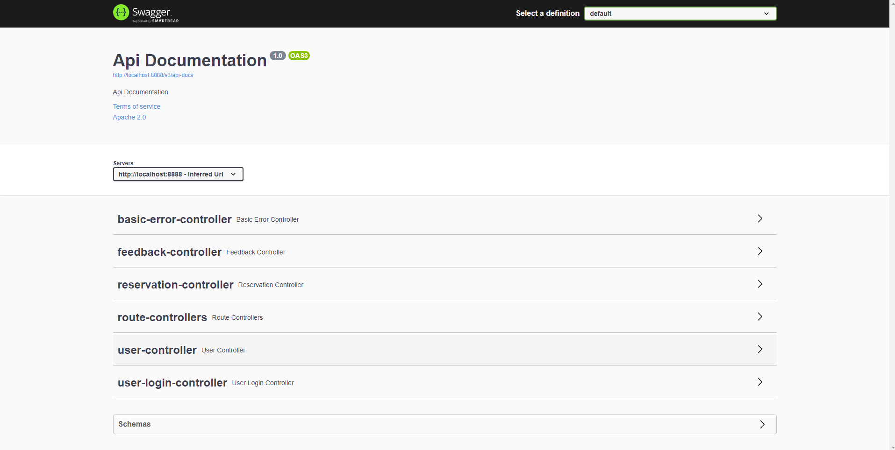
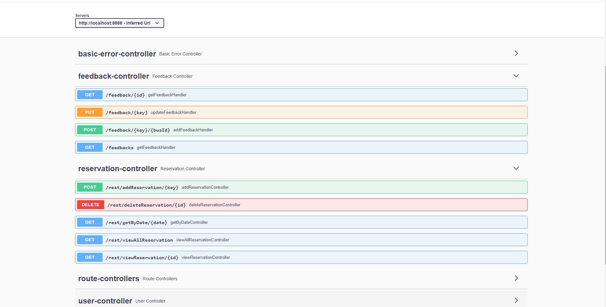
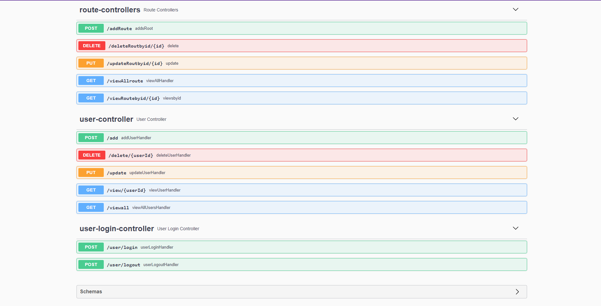

# Online Bus Adda (Bus Reservation)
- A collaborative project of an online bus reservation system.
- The Aim of this application is to form a bridge between Buses and customers.
- project code = -tired-calendar-1389

# Team members:
1. Rahul Rathore
2. Tanuj Pant
3. Ashish Yadav
4. Saurabh Patel
5. Shashi Ranjan

# problem statement
- 	The Aim of this application is to form a bridge between Buses and customers.
- 	The Bus owners must be able to sign in to the application to create and list out their Bus along with the fare price 
- 	So, that the customers could sign up , view the bus for each an every location.
- 	The customer selects the buses as per there convinience.

## Types of users
- Customer 
- Admin

## Tech Stack Used

- java
- MySql
- Springboot
- hibernate
- swagger 
- lombok
- spring JPA

